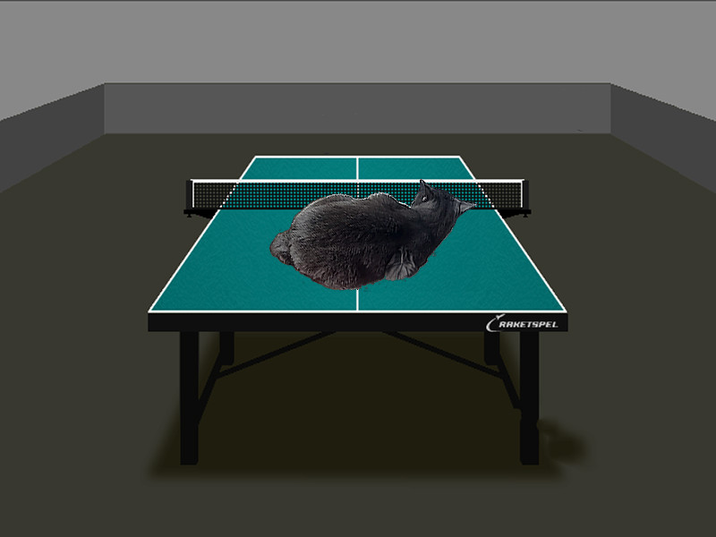

# Проект "Альфа-блендинг"
## Описание проекта
Основной целью данного проекта является тестирование оптимизаций для редактирования растровых изображений. Возьмем один из самых простых примеров обработки изобажений - попиксельное наложение 2-х картинок друг на друга c учетом прозрачности, или alpha-blending. Информацию об этом способе обработки изображений можно найти тут https://en.wikipedia.org/wiki/Alpha_compositing.
Реализуем такое наложение на С++ и посмотрим, как различные оптимизации влияют на время работы алгоритма.
## Инструменты и реализация
Для визуализации результата наложения будем использовать библиотеку SFML для C++.
Сначала напишем простую, "лобовую" реализацию алгоритма вычисления множества. С помощью модуля Clock библиотеки SFML будем засекать время, затрачиваемое на вычисление цветов пикселей с учетом прозрачности.
Для ускорения вычислений будем использовать Intrinsic functions, которые воплощают конвейерную реализацию вычислений с использованием AVX2 (Advanced Vector Extensions, расширение системы команд x86 процессоров Intel и AMD). Эти функции (Intrinsics) возьмем из библиотеки "immintrin.h" для C++.
Документации к этим функциям можно найти тут https://www.laruence.com/sse/.

## Реализованные функции
Релизовано 2 способа расчета цвета для пикселей картики с учетом прозрачности. Первый - обычный, для одиночных чисел, второй - с использованием 16-ти и 32-х байтных массивов и Intrinsic functions.
Формула рассчета компонент цвета (rgb) для каждого пикселя с учетом прозраности $a$:
$res_r = fr_r \cdot a + bk_r \cdot (255 - a)$
$res_g = fr_g \cdot a + bk_g \cdot (255 - a)$
$res_b = fr_b \cdot a + bk_b \cdot (255 - a)$
где $res_r$ - красная компонента результирующей картинки, $fr_g$ - зеленая компонента картинки переднего плана, $bk_b$ - синяя компонента картинки заднего плана. Остальные переменные в этих формулах трактуются аналогично.
В окне SFML реализована визуализация результата наложения.
Сама картинка выглядит следующим образом:


## Автоматическая сборка
Чтобы запустить программу, необходимо использовать Makefile, прилагающийся к проекту. Для этого после клонирования этого репозитория на ваш компьютер  необходимо в теминале из папки репозитория набрать "make". В самом Makefile в переменной CFLAGS необходимо указать нужный тип оптимизации (см. ниже). Используя флаг условной компиляции -DDRAW  (см. Makefile) можно включать и выключать отрисовку множества, а с помощью флага -DMEASURING можно входить и выходить из режима измерений.

## Сборка вручную
Для компиляции программы необходимо прописать в терминале следующую команду:

```g++ -mavx2 -c -O3 -DDRAW alpha_blending.cpp -o alpha_blending.o```

Сборка проекта:

```g++ alpha_blending.o -o alpha_blending -lsfml-graphics -lsfml-window -lsfml-system```

Чтобы запустить программу, пропишите в терминале:

```./alpha_blending```

## Как достичь максимальной скорости вычислений? 

Проведем измерения FPS (количество кадров в секунду, что соответствует количеству рассчетов для полного наложения фотографий в секунду). Для повышения точности измерений будем усреднять значение FPS за первые 100 рассчетов множества. После 100-ой итерации в консоль выводится надпись "end of measuring". Значит, можно закрывать окно и считывать усредненное значение FPS, которое так же будет выведено в консоль сразу после закрытия окна.
Число 100 выбрано экспериментально по соотношению "время тестирования-точность результата". При желании в коде можно изменять число измерений (константа NUM_MEASURES).

В процессе измерений важно не двигать мышкой, не нажимать кнопки клавиатуры и не нагружать процессор другими способами. Эти сторонние факторы могут исказить результаты измерений.
Для упрощения измерений запустим функции рассчета с AVX и без AVX последовательно друг за другом, вычисляя FPS отдельно для каждой функции.

Так как FPS получается достаточно большим, будем записывать в таблицу значение, в 100 раз меньшее реального значения.

### С отрисовкой

| Флаг оптимизации |       AVX2, fps/100    |  Без AVX2, fps/100   | Ускорение, раз |
| :------:         | :---------------:  | :------------:   | :------------: |
|    none          |       19.9         |       19.3       |       1.03     |
|    -O3           |       136.0        |       200.0      |       0.68     |
|   -Ofast         |       120.0        |       176.8      |       0.68     |

В графе "Ускорение" указано, во сколько раз использование AVX ускорило расчет по сравнению с одиночными вычислениями $\textit{при неизменном флаге компиляторной оптимизации}$.

Теперь программно уберем отрисовку (сделаем пустое окно) и посмотрим, какого ускорения мы сможем достичь в этом случае. 

### Без отрисовки
Проведем замеры FPS для разных оптимизаций при отключенной отрисовке. 
| Флаг оптимизации |       AVX2, fps/100        |    Без AVX2, fps/100    | Ускорение, раз |
| :------:         | :---------------: | :------------: | :------------: |
|       none       |       18.8        |       19.3     |       0.97     |
|       -O1        |       112.3       |       71.2     |       1.58     |
|       -O2        |       118.1       |       90.2     |       1.31     |
|       -O3        |       118.1       |       178.7    |       0.66     |
|       -Ofast     |       127.7       |       201.5    |       0.63     |

В графе "Ускорение" указано, во сколько раз использование AVX ускорило расчет по сравнению с одиночными вычислениями $\textit{при неизменном флаге компиляторной оптимизации}$.

Отключение отрисовки практически не изменило времени работы программы.

## Сравнение результатов и выводы
Итого, мы получили, что использование AVX2 оказывается далеко не всегда быстрее, чем обычная реализация алгоритма с одиночными числами. Так, AVX2 в некоторых случаях ускоряет алгоритм до 1.6 раза, а в некоторых замедляет до 1.6 раза (см. таблицы). Получается, что соотношение времен работы алгоритма с AVX и без AVX сильно зависит от типа компиляторной оптимизации, примененной на стадии компиляции проекта. При отсутствии компиляторной оптимизации (флаг -O0) реализации с AVX и без AVX показывают примерно одинаковые скорости вычислений.

Чтобы объяснить такой результат, посмотрим на результат компиляции программы при помощи godbolt.org. Оказывается, что при использовании AVX с любым флагом оптимизации присутствует приличное количество пересылок по памяти, потому что создается много временных переменных, без которых нельзя обойтись. Поэтому получается, что при выставлении флага оптимизации -O3 и выше компилятор лучше оптимизирует одиночные вычисления (из-за отсутствия большого количества операций с памятью), чем конвейерные функции AVX2.

Таким образом, конвейерные оптимизации не всегда оказываются лучше одиночных вычислений. Флаги компиляторной оптимизации -O3 и выше справляются с оптимизацией одиночных вычислений лучше, чем это делают Intrinsic functions. Итого, не существует "идеального" механизама оптимизации вычислений. В каждом конкретном случае необходимо учитывать специфику задачи и использовать те инструменты оптимизации, которые проявят себя лучше всего.

Также необходимо отметить, что результаты измерений fps сильно зависят от многих факторов: от типа и модели процессора, от его загруженности и даже температуры. Результаты, представленные в работе, соответствуют запуску программы на процессоре Intel Core i5 при использовании Linux Mint 21. Все результаты получены при соблюдении практически одинаковых внешних условий. Результаты измерений могут количественно отличаться в зависимости от условий запуска программы, но все качественные зависимости и тенденции, отмеченные в работе, сохранятся.